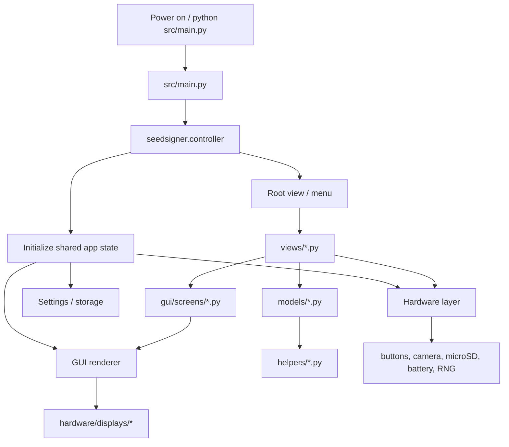
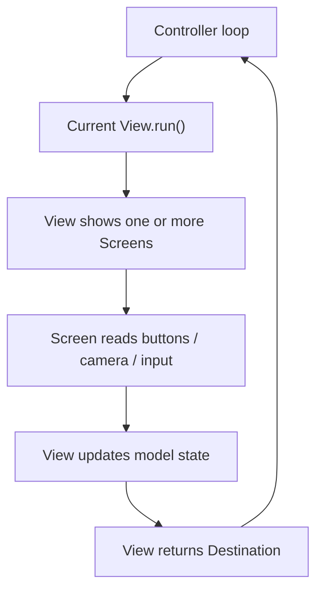
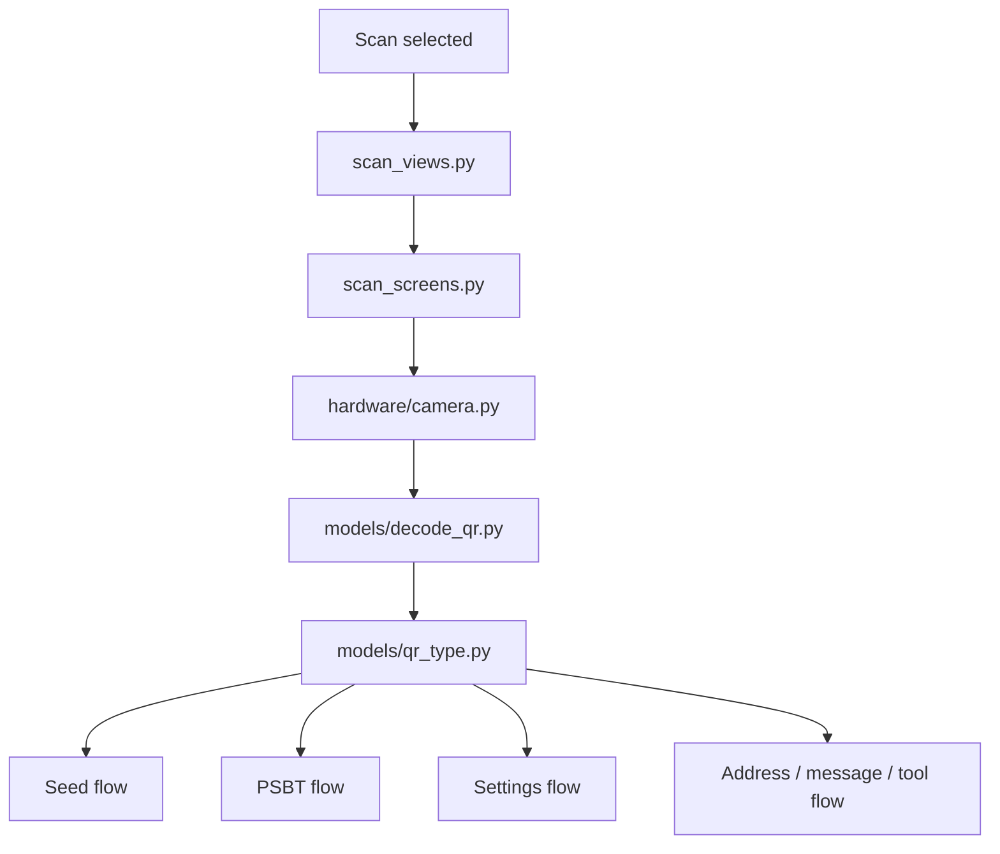
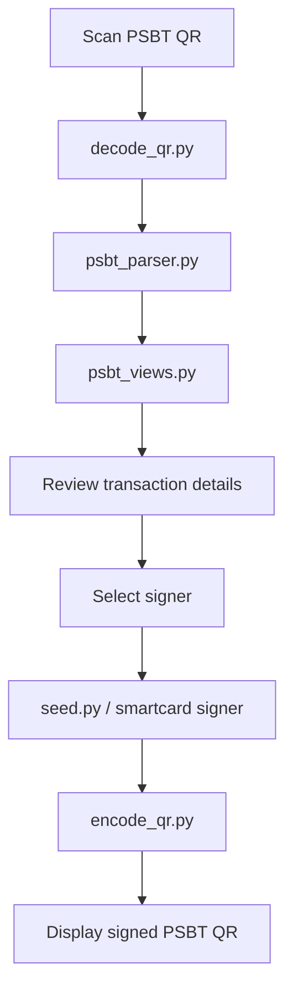
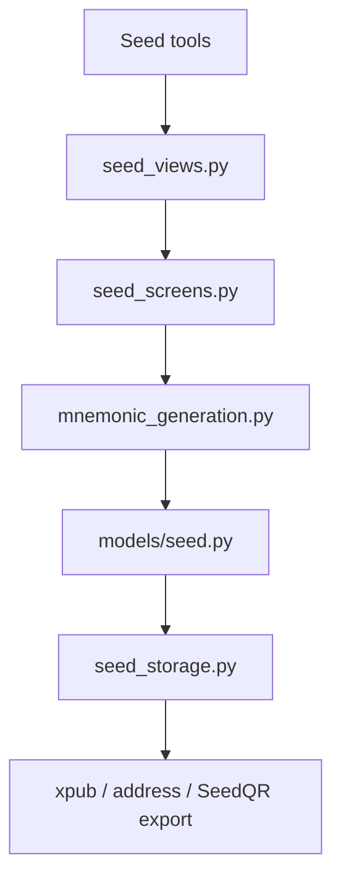
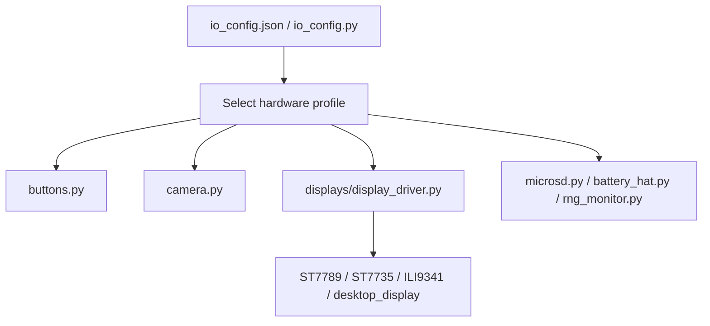

# SeedSigner Architecture Flow

## Boot And Runtime Flow

## Mental Model

SeedSigner is arranged like a small hardware application with a clear split:

| Layer       | Files                                                     | Job                                                                                                            |
| ----------- | --------------------------------------------------------- | -------------------------------------------------------------------------------------------------------------- |
| Entry point | `src/main.py`                                             | Starts the app and hands control to the controller.                                                            |
| Controller  | `src/seedsigner/controller.py`                            | Central navigation and runtime coordinator.                                                                    |
| Views       | `src/seedsigner/views/*.py`                               | High-level user flows: scan, seed, PSBT, settings, tools, smartcard, warnings.                                 |
| Screens     | `src/seedsigner/gui/screens/*.py`                         | Concrete UI screens and drawing logic for each flow.                                                           |
| GUI core    | `components.py`, `renderer.py`, `keyboard.py`, `toast.py` | Shared UI widgets, display rendering, text entry, status/toast messages.                                       |
| Hardware    | `hardware/*.py`, `hardware/displays/*.py`                 | Buttons, camera, display drivers, microSD, battery, IO config, RNG monitoring.                                 |
| Models      | `models/*.py`                                             | Bitcoin/domain state: seed, settings, QR decoding/encoding, PSBT parsing, encryption, WIF, BIP38.              |
| Helpers     | `helpers/*.py`, `helpers/ur2/*.py`                        | Lower-level utilities: QR formats, mnemonic generation, BIP85, Base43, smartcard helpers, UR2 encoding.        |
| Resources   | `resources/*`                                             | Fonts, icons, images, translations, diceware wordlists.                                                        |
| Tests       | `tests/test_*.py`                                         | Unit and flow tests covering controller, models, views, settings, PSBT, seed QR, smartcard, hardware profiles. |

## Main Interaction Loop

The controller is the traffic cop. It owns the app loop, sends the user into a View, waits for that View to finish, then receives a destination for the next View.

## QR Scan Flow

## PSBT Signing Flow

## Seed Flow

## Hardware Flow

## Where To Look First When Refactoring

| Goal                        | Start here                            | Then inspect                                                                          |
| --------------------------- | ------------------------------------- | ------------------------------------------------------------------------------------- |
| App startup / boot behavior | `src/main.py`                         | `controller.py`, `models/settings.py`, `hardware/io_config.py`                        |
| Navigation bugs             | `controller.py`                       | `views/view.py`, `tests/test_controller.py`, `tests/test_flows*.py`                   |
| Screen rendering/layout     | `gui/screens/screen.py`               | `gui/components.py`, `gui/renderer.py`, flow-specific screen file                     |
| Camera/QR scanning          | `views/scan_views.py`                 | `gui/screens/scan_screens.py`, `hardware/camera.py`, `models/decode_qr.py`            |
| PSBT parsing/signing        | `views/psbt_views.py`                 | `models/psbt_parser.py`, `models/seed.py`, smartcard helpers                          |
| Seed generation/storage     | `views/seed_views.py`                 | `models/seed.py`, `models/seed_storage.py`, `helpers/mnemonic_generation.py`          |
| Display driver work         | `hardware/displays/display_driver.py` | `ST7789.py`, `st7789_mpy.py`, `ST7735.py`, `ili9341.py`, `desktop_display.py`         |
| Smartcard/Satochip work     | `views/smartcard_views.py`            | `helpers/satochip_signer.py`, `helpers/seedkeeper_utils.py`, `helpers/keycard_*`      |
| Settings behavior           | `models/settings.py`                  | `models/settings_definition.py`, `views/settings_views.py`, `tests/test_settings*.py` |

## Practical Architecture Notes

- `views/` should stay focused on user intent and navigation.
- `gui/screens/` should stay focused on pixels, layout, and button prompts.
- `models/` should own domain logic that can be tested without hardware.
- `helpers/` should hold reusable protocol/crypto/encoding helpers.
- `hardware/` should isolate real device IO from the rest of the app.
- `tests/test_flows*.py` are the best warning system when cleaning up navigation.
- `tests/test_*qr*.py`, `test_psbt*.py`, and `test_seed*.py` matter most before touching signing or seed logic.
